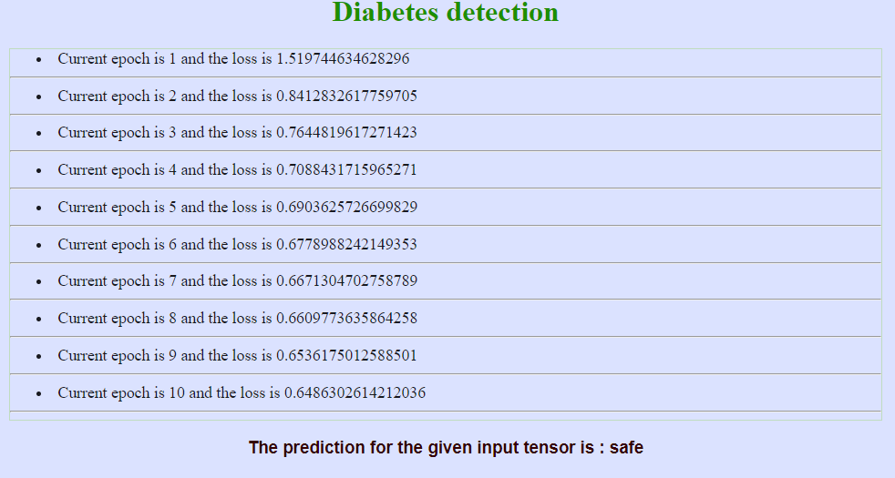

# Diabetes-detection

TESTING :

for training the model with an existing dataset, you will need to add Web Server for Chrome Extension to your browser. 

Once added, you’ll find the extension here : chrome://apps.
Start it and choose your folder .

Then, you just need to click on the index.html file and model training will start. 
And you’ll see the model training details and model inference in your index.html page.

RESULT : 

